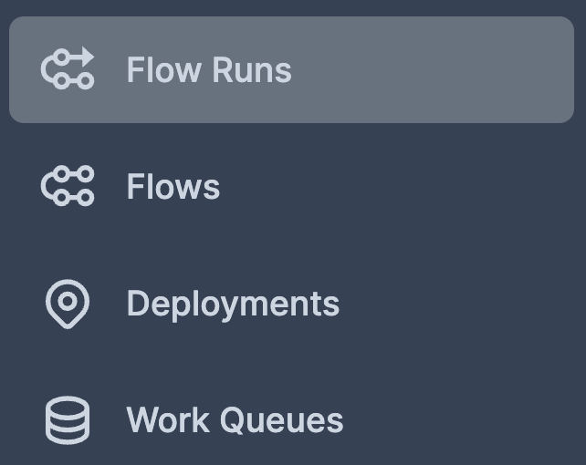

# An App to Visualize Your GitHub Events Filtered by Your Favorite Language

## Motivation
GitHub feed is a great way for you to get updated with what's trending in the community. You can discover some useful repositories by looking at what your connections star.


However, there might be some repositories you don't care about. For example, you might be only interested in Python repositories while there are repositories written in other languages. Thus, it takes you a while to find interesting libraries.

Wouldn't it be nice if you can create a personal dashboard showing the repositories that your connections followed filtered by your favorite language? 


This repository allows you to do exactly that.

## How to Create a Dashboard in Your Local Machine
### Set Up the Environment
1. Clone this repositories
```bash
git clone https://github.com/khuyentran1401/analyze_github_feed
```
2. Create and activate a virtual environment
```bash
python3 -m venv venv
source venv/bin/activate
```
3. Install dependencies:
```bash
pip install -r requirements.txt
```

### Pull Data From Your GitHub Feed
#### Get authentication
To pull data from your GitHub feed, you will need a GitHub username and [an access token](https://docs.github.com/en/authentication/keeping-your-account-and-data-secure/creating-a-personal-access-token). Create and save your GitHub authentication in the `.env` file in your local machine:
```bash
# .env
username=YOUR_USERNAME
token=YOUR_TOKEN
```
#### Get and Process Data
Next, run `get_and_process_data.py` under `development` to pull data from your GitHub feed and process the data.
```bash
cd development
python get_and_process_data.py
```
By default, the script only saves Python repositories and filters out other languages. If you are interested in getting the repositories in other languages, type:
```bash
python get_and_process_data.py <YOUR-FAVORITE-LANGUAGE>
```
For example, if you want to get all repos in Java, type:
```bash
python get_and_process_data.py Java
```

### View Your Dashboard
To open a dashboard showing the statistics of all saved repositories, type:
```bash
cd ../app
streamlit run Visualize.py
```
And you should see something like the below:


## Schedule Your Flows
If you want to pull the data from Github and process that data every day, you can use Prefect deployment. 

Go to the directory contains the file `deployment.py`:
```bash
cd development
```
### Start a server
Start a Prefect Orion server:
```bash
prefect orion start
```

### Configure a storage
Configure storage:
```bash
prefect storage create
```
And you will see the following options on your terminal.
```bash
Found the following storage types:
0) Azure Blob Storage
    Store data in an Azure blob storage container.
1) File Storage
    Store data as a file on local or remote file systems.
2) Google Cloud Storage
    Store data in a GCS bucket.
3) Local Storage
    Store data in a run's local file system.
4) S3 Storage
    Store data in an AWS S3 bucket.
5) Temporary Local Storage
    Store data in a temporary directory in a run's local file system.
Select a storage type to create:
```
For a quick start, you can choose 5 to save your flow runs in a local storage. 
### Create a work queue
Create a work queue
```bash
prefect work-queue create --tag dev dev-queue
```
Output:
```bash
UUID('e0e4ee25-bcff-4abb-9697-b8c7534355b2')
```
### Run an agent
To run an agent, type prefect agent start <ID of dev-queue> . Since the ID of the dev-queue is `e0e4ee25-bcff-4abb-9697-b8c7534355b2` , we type:

```bash
prefect agent start 'e0e4ee25-bcff-4abb-9697-b8c7534355b2'
```
### Create a deployment
In another terminal, create a deployment
```bash
cd development
prefect deployment create deployment.py
```

### View the dashboard
Now go to http://127.0.0.1:4200/ and click Deployments then click the deployment `Github-repo-flow`:


Then click Run in the top right corner:


Then click Flow Runs on the left menu:



And you will see that your flow is scheduled!


Now if you don't turn off your machine or shut down your agent, the script to pull and process data will run every day.